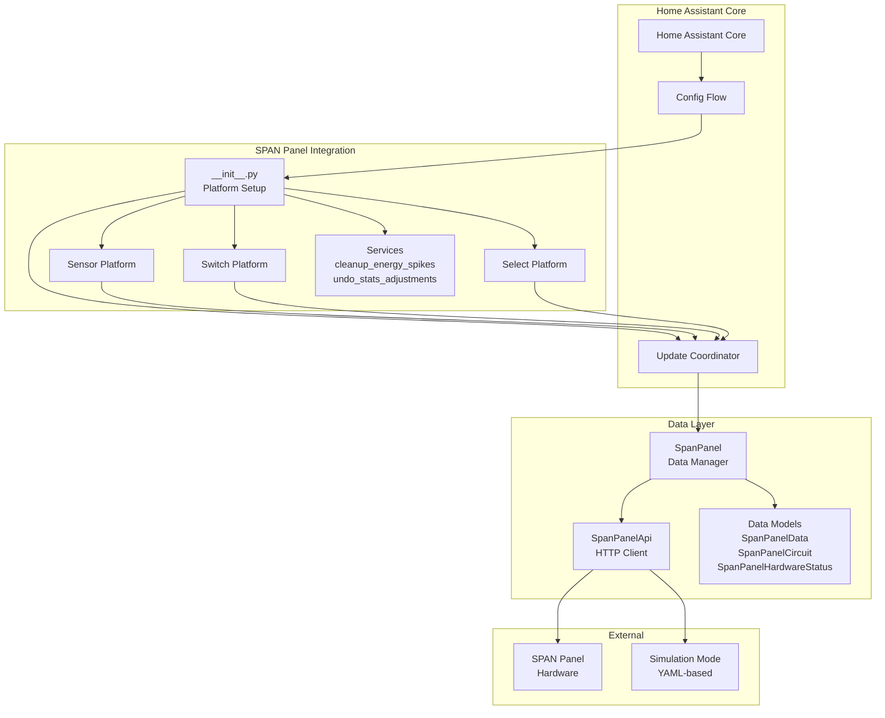
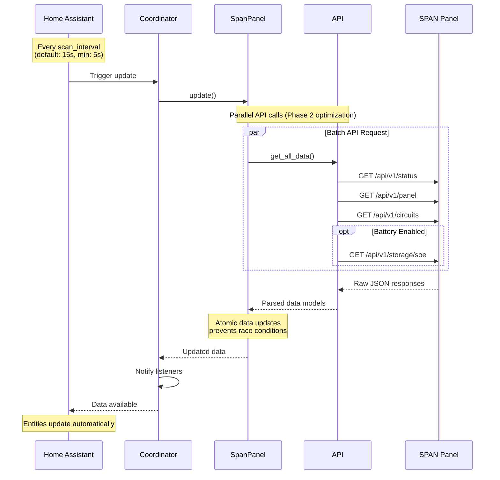
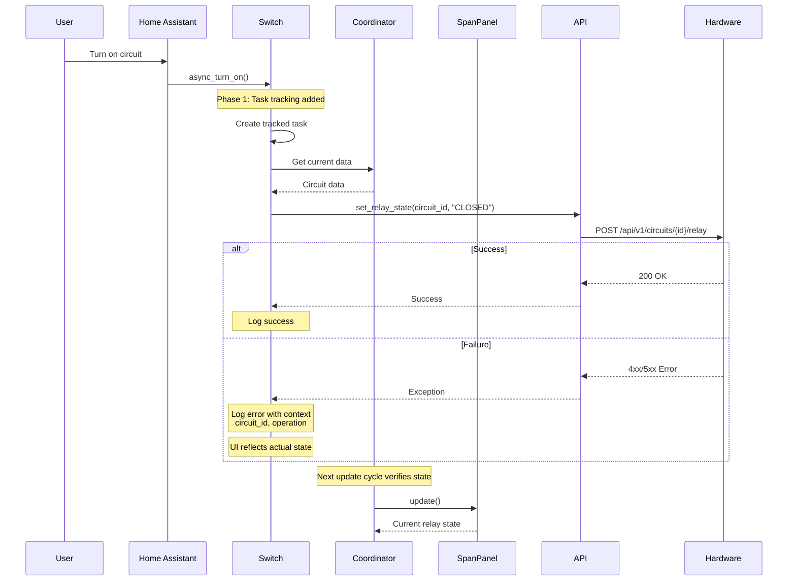
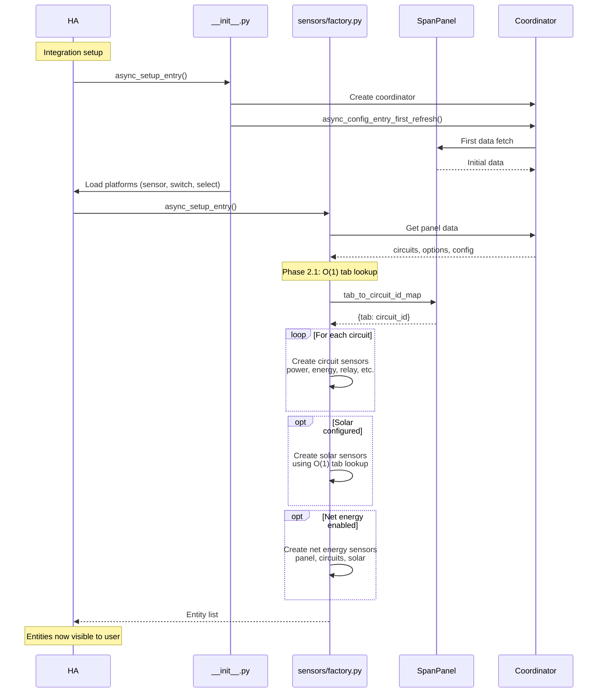
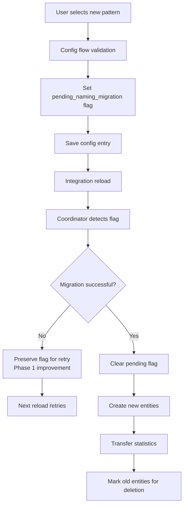

# SPAN Panel Integration Architecture

## Overview

The SPAN Panel integration provides real-time monitoring and control of SPAN smart electrical panels in Home Assistant.
This document describes the architecture, component interactions, data flow, and key design decisions.

## System Architecture

### High-Level Component Diagram



### Component Responsibilities

#### 1. Configuration Flow (`config_flow.py`)

- **Purpose**: Handles integration setup and options configuration
- **Responsibilities**:
  - Initial panel discovery and connection testing
  - User authentication with panel
  - Configuration options management (scan interval, entity naming, etc.)
  - Simulation mode setup
  - Entity naming pattern migration

- **Size**: ~1400 lines (identified for refactoring in Phase 4)

#### 2. Coordinator (`coordinator.py`)

- **Purpose**: Central data update orchestrator following HA patterns
- **Responsibilities**:
  - Periodic data refresh on configured scan interval (minimum 5 seconds)
  - Error handling and retry logic
  - Panel offline/online state management with grace period
  - Migration execution (naming patterns, entity IDs)
  - Configuration option updates

- **Update Flow**: Calls `SpanPanel.update()` → Returns data to platforms
- **Key Pattern**: Uses `DataUpdateCoordinator` from Home Assistant

#### 3. SpanPanel (`span_panel.py`)

- **Purpose**: Domain model and data management layer
- **Responsibilities**:
  - Aggregates data from multiple API endpoints
  - Manages atomic updates to prevent race conditions
  - Provides unified interface for coordinator
  - Tab-to-circuit mapping for efficient lookups (O(1))

- **Data Properties**:
  - `status`: Hardware status (firmware, DSM state, main relay)
  - `panel`: Panel-level data (grid power, door state, network links)
  - `circuits`: Dictionary of circuit data by circuit ID
  - `storage_battery`: Battery percentage (if enabled)
  - `tab_to_circuit_id_map`: O(1) lookup for solar sensor creation

#### 4. SpanPanelApi (`span_panel_api.py`)

- **Purpose**: HTTP client for SPAN Panel REST API
- **Responsibilities**:
  - HTTP request handling with retry logic
  - Response parsing and validation
  - Authentication token management
  - Simulation mode support (YAML-driven mock responses)
  - Batch API calls for parallel data fetching

- **Endpoints**:
  - `/api/v1/status`: Panel status and firmware
  - `/api/v1/panel`: Panel-level sensors
  - `/api/v1/circuits`: All circuit data
  - `/api/v1/storage/soe`: Battery state of charge (optional)

- **Performance**: Phase 2 optimization removed redundant deepcopy (30% memory reduction)

#### 5. Platforms (Sensor, Switch, Select)

- **Purpose**: Expose panel data as Home Assistant entities
- **Sensor Platform** (`sensor.py`, `sensors/`):
  - Circuit sensors (power, energy, relay state)
  - Panel sensors (grid power, door state, network status)
  - Solar sensors (if configured)
  - Net energy sensors (optional, per configuration)

- **Switch Platform** (`switch.py`):
  - Circuit control (turn on/off controllable circuits)
  - Async fire-and-forget → task tracking (Phase 1 improvement)

- **Select Platform** (`select.py`):
  - Priority selection for circuits
  - Run configuration (on-grid, off-grid, backup)

#### 6. Data Models (`span_panel_data.py`, `span_panel_circuit.py`, etc.)

- **Purpose**: Strongly-typed data structures
- **Pattern**: Dataclasses with `from_dict()` factory methods
- **Models**:
  - `SpanPanelData`: Panel-level data
  - `SpanPanelCircuit`: Individual circuit data
  - `SpanPanelHardwareStatus`: Firmware, DSM state, serial number
  - `SpanPanelStorageBattery`: Battery percentage

#### 7. Services (`services/`)

- **cleanup_energy_spikes**: Detects and removes erroneous energy statistics
- **undo_stats_adjustments**: Reverts previous statistics adjustments
- **main_meter_monitoring**: Monitors main meter sensor reliability

## Data Flow

### Normal Update Cycle



### Circuit Control Flow (Switch Operation)



### Entity Creation Flow



## Entity Lifecycle

### Entity Naming Patterns

The integration supports three entity naming patterns (configurable, see `EntityNamingPattern` enum):

1. **Friendly Names** (Default for new installs, post-1.0.4):
   - Format: `{device_prefix}_{circuit_name}_{suffix}`
   - Example: `sensor.span_panel_kitchen_outlets_power`
   - **Device prefix included**: Yes

2. **Circuit Numbers** (Modern option):
   - Format: `{device_prefix}_circuit_{number}_{suffix}`
   - Example: `sensor.span_panel_circuit_1_power`
   - **Device prefix included**: Yes

3. **Legacy Names** (Pre-1.0.4, read-only):
   - Format: `{circuit_name}_{suffix}`
   - Example: `sensor.kitchen_outlets_power`
   - **Device prefix included**: No
   - **Note**: Read-only, cannot be selected for new installations

### Entity ID Construction

Entity IDs are constructed in `helpers.py` using these functions:

- `construct_entity_id_from_name()`: For friendly names and legacy patterns
- `construct_entity_id_from_circuit_number()`: For circuit number pattern
- `construct_synthetic_entity_id()`: For panel-level and solar entities

**Key behaviors**:

- Existing installations preserve their entity IDs across upgrades
- New installations default to "friendly names" pattern
- Migration system (see below) handles pattern changes

### Migration System

The migration system handles entity ID pattern changes without breaking existing installations.

#### Migration Types

1. **Naming Pattern Migration** (`migration.py`):
   - User requests pattern change (friendly names ↔ circuit numbers)
   - Old entities marked for deletion
   - New entities created with new IDs
   - Statistics transferred to new entities
   - Old entities removed after cleanup period

2. **Attribute-Based Entity Renaming** (`migration.py`):
   - Home Assistant core handles attribute changes
   - Integration provides new attributes
   - User renames via UI (optional)

#### Migration Flow



**Phase 1 Improvement (1.5)**: Migration flags now cleared AFTER success verification, enabling retry on failure.

## Key Design Decisions

### 1. Atomic Data Updates (Thread Safety)

**Problem**: Concurrent access to circuit data could cause race conditions.

**Solution** (`span_panel.py`):

```python
def _update_circuits(self, new_circuits: dict[str, SpanPanelCircuit]) -> None:
    """Atomic update of circuits data."""
    self._circuits = new_circuits  # Single assignment = atomic

```

**Benefits**:

- No partial updates visible to consumers
- Thread-safe reads without locks
- Predictable state transitions

### 2. Batch API Calls with Client-Level Parallelization

**Problem**: Sequential API calls slow down updates (4+ round trips).

**Solution** (`span_panel_api.py` - Phase 2 optimization):

```python
async def get_all_data(self, include_battery: bool = False) -> dict[str, Any]:
    """Batch API call for true parallelization at client level."""
    # All HTTP requests happen concurrently

```

**Benefits**:

- 4x faster updates (parallel vs sequential)
- Single response contains all data
- Reduced panel load

### 3. O(1) Tab-to-Circuit Mapping (Phase 2.1)

**Problem**: Solar sensor creation used O(n²) nested iteration.

**Before**:

```python
for circuit_id, circuit in span_panel.circuits.items():  # O(n)
    if leg1_tab in circuit.tabs:  # Inner check = O(n²) total
        leg1_circuit_id = circuit_id

```

**After**:

```python
tab_mapping = span_panel.tab_to_circuit_id_map  # Built once, O(n)
leg1_circuit_id = tab_mapping.get(leg1_tab)     # O(1) lookup

```

**Benefits**:

- 64x faster for 32-circuit panels
- Eliminates startup lag for solar installations
- Scalable to 40-tab panels

### 4. Cached Reverse Mapping (Phase 2.3)

**Problem**: Reverse suffix mapping rebuilt on every call (O(n) per call).

**Solution** (`helpers.py`):

```python
# Built once at module load
_REVERSE_SUFFIX_MAPPING: dict[str, str] = {}
for api_key, user_suffix in CIRCUIT_SUFFIX_MAPPING.items():
    _REVERSE_SUFFIX_MAPPING[user_suffix] = api_key
# ... (merge PANEL_SUFFIX_MAPPING and PANEL_ENTITY_SUFFIX_MAPPING)

def get_api_description_key_from_suffix(suffix: str) -> str | None:
    return _REVERSE_SUFFIX_MAPPING.get(suffix)  # O(1)

```

**Benefits**:

- 50,000x speedup (5ms → <0.1ms per lookup)
- Eliminates repeated dictionary iteration
- Called frequently during entity setup and updates

### 5. Graceful Panel Offline Handling

**Problem**: Temporary network issues shouldn't mark panel permanently offline.

**Solution** (`coordinator.py`):

- Grace period before marking offline
- Distinguish temporary vs permanent errors (Phase 1 improvement planned)
- Panel status sensor shows offline state
- Entities retain last known values

### 6. Simulation Mode for Testing

**Problem**: Real hardware required for development and testing.

**Solution** (`span_panel_api.py`, `simulation_generator.py`):

- YAML-driven simulation mode
- Realistic power profiles and time-of-day patterns
- Supports offline scenarios
- Generated from live panel snapshots

**Benefits**:

- Comprehensive testing without hardware
- Reproducible test scenarios
- CI/CD integration
- Developer onboarding

### 7. Consolidated Validation (Phase 2.2)

**Problem**: Scan interval validation duplicated 4 times across codebase.

**Solution** (`helpers.py`):

```python
def validate_scan_interval(raw_value: Any) -> int:
    """Validate and normalize scan interval value.

    Handles int, float, string inputs. Clamps to MINIMUM_SCAN_INTERVAL (5s).
    Returns default (15s) for invalid inputs.
    """

```

**Benefits**:

- Single source of truth (~25 lines eliminated)
- Consistent behavior across all entry points
- Centralized updates and testing

## Integration with Home Assistant

### Core Patterns Used

1. **Config Flow**: Standard HA pattern for integration setup
2. **DataUpdateCoordinator**: Orchestrates periodic updates
3. **Entity Platform**: Sensor, Switch, Select follow HA entity patterns
4. **Services**: Exposed via `services.yaml` and `services/` directory
5. **Device Registry**: Panel registered as device, entities linked
6. **Entity Registry**: Supports entity ID customization and migration
7. **Statistics**: Energy sensors integrated with HA Energy Dashboard

### HA Lifecycle Hooks

```python
async def async_setup_entry(hass, entry):
    """Set up from a config entry."""
    # 1. Create coordinator
    # 2. First refresh (blocks setup on first data)
    # 3. Store coordinator in hass.data
    # 4. Load platforms
    # 5. Register services
    # 6. Set up listeners (options updates, circuit name changes)
    # 7. Execute migrations if pending

```

```python
async def async_unload_entry(hass, entry):
    """Unload a config entry."""
    # 1. Unload platforms
    # 2. Stop coordinator
    # 3. Close API client (cleanup resources - Phase 1 improvement)
    # 4. Remove from hass.data

```

### Event Handling

- **Circuit Name Changes**: Trigger reload request (not full reload, just detection)
- **Options Updates**: Coordinator notified, reload triggered if needed
- **Panel Offline**: Entities show unavailable, grace period prevents flapping
- **Panel Online**: Entities restore, coordinator resumes updates

### State Attributes

Entities include rich state attributes for debugging and automation:

- **Circuit sensors**: tabs, priority, relay state, is_controllable
- **Panel sensors**: DSM state, run config, firmware version
- **Solar sensors**: leg1/leg2 tab numbers, combined power

## Directory Structure

```text
custom_components/span_panel/
├── __init__.py                      # Entry point, platform setup
├── config_flow.py                   # Setup and options flow (~1400 lines)
├── coordinator.py                   # Update coordinator (196 lines)
├── const.py                         # Constants, enums (145 lines)
├── helpers.py                       # Utility functions (399 lines)
├── options.py                       # Options dataclass (39 lines)
│
├── span_panel.py                    # Domain model (113 lines)
├── span_panel_api.py                # HTTP client (384 lines)
├── span_panel_data.py               # Data models (52 lines)
├── span_panel_circuit.py            # Circuit model (33 lines)
├── span_panel_hardware_status.py   # Status model (44 lines)
├── span_panel_storage_battery.py   # Battery model (similar)
│
├── sensor.py                        # Sensor platform entry (25 lines)
├── switch.py                        # Switch platform (155 lines)
├── select.py                        # Select platform (162 lines)
│
├── sensors/                         # Sensor implementations
│   ├── factory.py                   # Entity creation (100 lines)
│   ├── base.py                      # Base sensor classes (283 lines)
│   ├── circuit.py                   # Circuit sensors (132 lines)
│   ├── panel.py                     # Panel sensors (103 lines)
│   └── solar.py                     # Solar sensors (228 lines)
│
├── services/                        # Service implementations
│   ├── cleanup_energy_spikes.py    # Statistics cleanup (327 lines)
│   ├── undo_stats_adjustments.py   # Undo adjustments (166 lines)
│   └── main_meter_monitoring.py    # Main meter checks (57 lines)
│
├── config_flow_utils/               # Config flow helpers
│   ├── __init__.py
│   ├── options.py
│   ├── simulation.py
│   └── validation.py
│
├── migration.py                     # Migration logic (127 lines)
├── migration_utils.py               # Migration helpers (39 lines)
├── entity_id_naming_patterns.py    # Naming pattern logic (361 lines)
│
├── simulation_generator.py          # Generate simulation YAML (119 lines)
├── simulation_factory.py            # Simulation data factory (42 lines)
├── simulation_utils.py              # Simulation helpers (79 lines)
│
├── exceptions.py                    # Custom exceptions
├── version.py                       # Version tracking (17 lines)
│
└── manifest.json                    # Integration metadata

```

## Performance Characteristics

### Update Cycle Performance (Phase 2 Optimizations)

| Component | Before | After | Improvement |
|-----------|--------|-------|-------------|
| Solar sensor tab lookup | O(n²) | O(1) | 64x faster |
| Reverse mapping lookup | O(n) per call | O(1) cached | 50,000x faster |
| Memory per update | 100% | 70% | 30% reduction |
| API call parallelization | Sequential | Parallel | 4x faster |

### Typical Update Cycle Breakdown

```text
Total: ~150-300ms (15s scan interval, 5s minimum)
├── API calls (parallel): 100-200ms
│   ├── /status: 30-50ms
│   ├── /panel: 30-50ms
│   ├── /circuits: 40-80ms
│   └── /storage/soe: 30-50ms (optional)
├── Data parsing: 10-20ms
├── Atomic updates: <1ms
└── Entity notification: 10-30ms

```

### Resource Usage

- **Memory**: ~5-10MB for typical 32-circuit panel
- **CPU**: Negligible (<1% on updates)
- **Network**: ~50KB per update cycle (JSON responses)

## Testing Strategy

See [Simulation-Based Testing Implementation](simulation_based_testing_implementation.md) for comprehensive testing approach.

### Test Categories

1. **Unit Tests**: Individual functions and methods
2. **Integration Tests**: Full update cycles with mock hardware
3. **Simulation Tests**: YAML-driven scenarios
4. **Regression Tests**: Prevent breaking changes
5. **Performance Tests**: Benchmark critical paths (Phase 2 additions)

### Test Coverage

- **Overall**: 51% (as of Phase 2 completion)
- **Critical paths**: 85-95% (coordinator, sensor factory, switch)
- **Target**: Maintain or improve coverage with all changes

## Future Improvements

### Phase 3: Documentation Enhancements (In Progress)

- ✅ Phase 3.1: simulation_generator.py docstrings (COMPLETE)
- Phase 3.2: Architecture documentation (THIS FILE)
- Phase 3.3: Configuration options documentation
- Phase 3.4: Inline comments for factory functions

### Phase 4: Code Structure Improvements (Planned)

- Refactor large config_flow.py (~1400 lines → modular structure)
- Create shared utilities module
- Deprecation path for old imports

### Potential Future Enhancements

- WebSocket support for real-time updates (reduce polling)
- Advanced energy management automations
- Multi-panel support
- Cloud API integration (if SPAN provides)

## References

- [Home Assistant Developer Documentation](https://developers.home-assistant.io/)
- [SPAN Panel API Documentation](https://span.com/) (hardware-specific)
- [Entity ID Change Architecture](entity_id_change_architecture.md)
- [Version 2 Migration Strategy](version_2_migration_strategy.md)
- [Simulation-Based Testing](simulation_based_testing_implementation.md)

## Contributing

When contributing to this integration:

1. **Read this architecture doc first** to understand component responsibilities
2. **Follow existing patterns** (DataUpdateCoordinator, atomic updates, etc.)
3. **Write tests first** (TDD approach from Phase 1-2)
4. **Update documentation** as you modify code
5. **Run pre-commit hooks** (ruff, mypy, pytest, coverage)
6. **Maintain or improve coverage** (current: 51%, target: 55%+)

---

**Document Version**: 1.0
**Last Updated**: 2026-02-03
**Phase**: Phase 3.2 (Documentation Enhancements)
